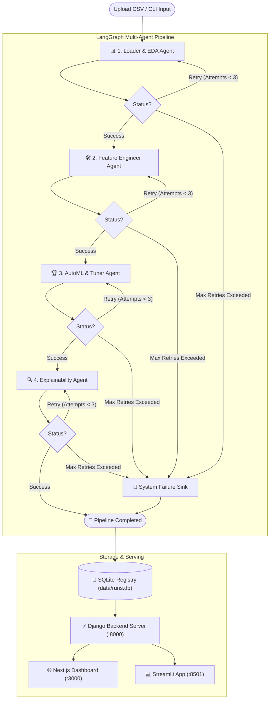

# Autonomous Multi-Agent Data Analyzer & AutoML Pipeline

> An end-to-end autonomous data science engine orchestrating specialized LLM agents using **LangGraph**, **Groq**, **Optuna**, **Scikit-Learn**, and **SHAP** with self-healing sandboxed execution, an asynchronous **Django** backend, and reactive **Next.js** and **Streamlit** user interfaces.

---

## 📖 Table of Contents

- [Overview](#-overview)
- [System Architecture](#-system-architecture)
- [Agent Workflow & Pipeline Stages](#-agent-workflow--pipeline-stages)
- [Key Features](#-key-features)
- [Repository Structure](#-repository-structure)
- [Installation & Setup](#-installation--setup)
- [How to Run](#-how-to-run)
  - [1. Web Interfaces (Django + Next.js / Streamlit)](#1-web-interfaces-django--nextjs--streamlit)
  - [2. CLI Execution (`main.py`)](#2-cli-execution-mainpy)
  - [3. REST API Endpoints](#3-rest-api-endpoints)
- [Robustness & Sandboxed Self-Healing](#-robustness--sandboxed-self-healing)
- [Configuration & LLM Providers](#-configuration--llm-providers)
- [Contributing](#-contributing)
- [License](#-license)

---

## 🌟 Overview

The **Autonomous Multi-Agent Data Analyzer** is an agentic data science platform designed to take any tabular CSV dataset and autonomously perform the full lifecycle of a senior data scientist:

1. **Exploratory Data Analysis (EDA)**: Profiling, missing value audits, correlation matrices, and distribution plots.
2. **Intelligent Feature Engineering**: Adaptive imputation, encoding, transformation, scaling, and train/test splitting.
3. **AutoML & Hyperparameter Optimization**: Bayesian optimization with Optuna to search model architectures and hyperparameters, evaluating champion models on holdout test sets.
4. **Model Interpretability & Business Insights**: Computing SHAP values, feature importance rankings, and synthesized natural-language strategic recommendations.

Unlike traditional black-box AutoML tools, every pipeline decision is written as inspectable Python code by LLM agents, executed in an isolated **state-recovering sandbox**, and logged to an audit trail with automatic **self-healing retry loops**.

---

## 🏗️ System Architecture

The pipeline is orchestrated with a **LangGraph StateGraph** where each node represents a dedicated agent. Communication between stages is strictly mediated through an immutable state schema (`DataScientistState`), passing file paths and metadata rather than in-memory objects.



---

## 🤖 Agent Workflow & Pipeline Stages

Each agent generates structured `<thought>` and `<code>` blocks:

| Agent | Responsibility | Key Outputs |
| :--- | :--- | :--- |
| **1. Loader & EDA Agent** | Profiles dataset schema (reading only 5 rows for efficiency), checks missingness, identifies target distributions, and generates correlation heatmaps. | `schema_summary`, `eda_plot_paths` (`.png`) |
| **2. Feature Engineer Agent** | Cleans dataset, handles missing values, encodes categorical variables, scales numeric columns, and writes the clean dataset to disk. | `cleaned_csv_path` (`.csv`) |
| **3. Hyperparameter Tuner Agent** | Formulates Optuna search spaces for classification/regression algorithms, evaluates cross-validation scores, trains the champion model, and serializes it. | `model_path` (`.joblib`), `metrics` (Accuracy, F1, ROC-AUC, RMSE, R²) |
| **4. Explainability Agent** | Calculates SHAP (Tree/Kernel Explainer) values on test data, plots feature importances, and extracts executive business insights. | `shap_plot_path` (`.png`), strategic insights |

---

## ✨ Key Features

- **🔄 Self-Healing Code Execution**: If agent-generated Python code throws an exception, the traceback is captured and injected back into the agent's prompt for dynamic self-correction (up to 3 retries per node).
- **🛡️ Isolated Sandbox Environment**: Code executes in a sandbox with deep-copied state rollbacks on errors, headless `plt.show()` trapping (forcing `plt.savefig`), and safe namespace scoping.
- **⚡ Background Pipeline Execution**: Runs are executed in decoupled background worker threads with streaming state updates, preventing UI blocking.
- **📊 Real-time Next.js & Streamlit Frontends**: 
  - Live pipeline progress and agent lifecycle tracking.
  - Interactive metric cards and data previews.
  - Visual galleries for EDA distributions, correlations, and SHAP feature importance plots.
  - One-click downloads for cleaned datasets and trained `.joblib` champion models.
  - Persistent run history and artifact isolation powered by SQLite.
- **🚀 Django REST API**: Unified backend with CORS support, thread-safe execution controllers (pause, resume, stop, rerun), sandbox code execution endpoint, and file streaming.

---

## 📁 Repository Structure

```text
multi_agent_autonomous_data_analyzer/
│
├── .gitignore              # Strict ignore rules (excludes models, data, runs, cache)
├── requirements.txt        # Core project dependencies
│
├── manage.py               # Django management script
├── backend_project/        # Django project configuration (settings, urls, wsgi, asgi)
├── api/                    # Django API application (views, urls)
│
├── state_schema.py         # DataScientistState TypedDict and constants
├── llm_provider.py         # LLM factory (Groq, Ollama abstraction)
├── parsing.py              # Robust parser for <thought> and <code> XML blocks
├── sandbox.py              # Isolated execution runtime with state rollback & safeguards
│
├── agents.py               # Node prompts and execution logic for all 4 agents
├── graph.py                # LangGraph StateGraph wiring with conditional retry edges
│
├── database.py             # SQLite persistence layer for run metadata & artifacts
├── main.py                 # CLI entry point for headless batch runs
├── frontend/               # Next.js frontend application
└── streamlit_app.py        # Streamlit frontend dashboard
```

---

## ⚙️ Installation & Setup

### Prerequisites
- **Python 3.10+**
- **Node.js 18+** (optional, for Next.js frontend)
- A **Groq API Key** (or local Ollama)

### 1. Clone the Repository
```bash
git clone https://github.com/SubhadeepSarkar04/Mutli_Agent_Autonomous_Data_Analyzer.git
cd Mutli_Agent_Autonomous_Data_Analyzer
```

### 2. Create and Activate a Virtual Environment
```bash
# Windows (PowerShell)
python -m venv .venv
.venv\Scripts\Activate.ps1

# Linux / macOS
python3 -m venv .venv
source .venv/bin/activate
```

### 3. Install Dependencies
```bash
pip install --upgrade pip
pip install -r requirements.txt
```

### 4. Configure Environment Variables
Set your Groq API key in your terminal or create a `.env` file:

```bash
# Windows (PowerShell)
$env:GROQ_API_KEY="your-groq-api-key-here"

# Linux / macOS
export GROQ_API_KEY="your-groq-api-key-here"
```

### Security defaults

The API is intended for trusted local development. By default it accepts CORS
requests from local Streamlit and Next.js development servers, limits CSV
uploads to 50 MB, and disables the custom-code endpoint.

Set these only when appropriate for your deployment:

```bash
MAX_UPLOAD_BYTES=52428800
CORS_ALLOWED_ORIGINS=http://localhost:3000,http://127.0.0.1:3000,http://localhost:8501,http://127.0.0.1:8501
ENABLE_CUSTOM_CODE_EXECUTION=1  # trusted local debugging only
```

---

## 🚀 How to Run

### 1. Web Interfaces (Django + Next.js / Streamlit)

Start the Django backend and whichever frontend interface you prefer:

#### **Terminal 1: Start Django Backend**
```bash
python manage.py runserver 8000
```
*API runs at `http://127.0.0.1:8000`.*

#### **Terminal 2: Start Frontend**

**Option A: Next.js Frontend (Modern UI)**
```bash
cd frontend
npm run dev
```
*Dashboard will open at `http://localhost:3000`.*

**Option B: Streamlit Dashboard**
```bash
streamlit run streamlit_app.py
```
*Dashboard will open at `http://localhost:8501`.*

---

### 2. CLI Execution (`main.py`)

Run the complete pipeline directly from your terminal:

```bash
# Classification Example
python main.py --csv_path Titanic-Dataset.csv --target Survived --type classification

# Regression Example
python main.py --csv_path path/to/housing.csv --target MedHouseVal --type regression
```

---

### 3. REST API Endpoints

You can trigger and monitor runs programmatically:

| Method | Endpoint | Description |
| :--- | :--- | :--- |
| `POST` | `/run` | Upload dataset CSV and trigger pipeline in the background (HTTP 202) |
| `GET` | `/runs` | List all past runs and their current statuses |
| `GET` | `/runs/{run_id}/status` | Poll current stage, metrics, logs, and error status |
| `GET` | `/runs/{run_id}/artifacts/{filename}` | Download generated artifacts (EDA plots, cleaned CSV) |
| `GET` | `/runs/{run_id}/model` | Binary download of serialized champion `.joblib` model |
| `POST` | `/runs/{run_id}/pause` | Pause active execution |
| `POST` | `/runs/{run_id}/resume` | Resume paused pipeline |
| `POST` | `/runs/{run_id}/stop` | Stop / abort execution |
| `POST` | `/runs/{run_id}/rerun` | Re-execute pipeline from scratch |
| `POST` | `/runs/{run_id}/execute_code` | Execute custom code in sandbox (if enabled) |
| `DELETE` | `/runs/{run_id}` | Delete a run and its isolated artifacts |
| `DELETE` | `/runs` | Clear all analysis history |

---

## 🛡️ Robustness & Sandboxed Self-Healing

The execution engine uses sandbox safeguards:

1. **State Snapshots**: Before agent code executes, the pipeline state is deeply copied. If an error occurs, the state is rolled back.
2. **Headless Plot Trapping**: Prevents GUI plot popups in headless servers, redirecting `plt.show()` to `plt.savefig()`.
3. **Multi-turn LLM Reflection**: When code execution fails, error tracebacks are fed back to the LLM agent to analyze and self-correct.

---

## 📄 License

This project is licensed under the MIT License.
