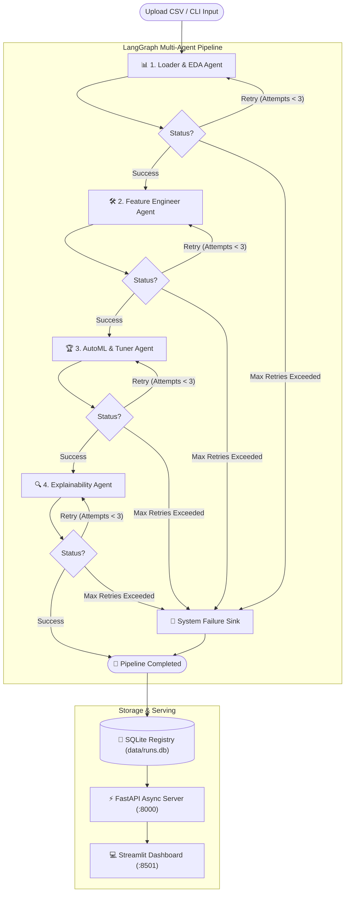

# 🤖 Autonomous Multi-Agent Data Analyzer & AutoML Pipeline

> An end-to-end autonomous data science engine orchestrating specialized LLM agents using **LangGraph**, **Groq**, **Optuna**, **Scikit-Learn**, and **SHAP** with self-healing sandboxed execution, an asynchronous **FastAPI** backend, and a reactive **Streamlit** dashboard.

[](https://www.python.org/)
[](https://github.com/langchain-ai/langgraph)
[](https://www.langchain.com/)
[](https://groq.com/)
[](https://optuna.org/)
[](https://fastapi.tiangolo.com/)
[](https://streamlit.io/)
[](LICENSE)

---

## 📖 Table of Contents

- [Overview](#-overview)
- [System Architecture](#-system-architecture)
- [Agent Workflow & Pipeline Stages](#-agent-workflow--pipeline-stages)
- [Key Features](#-key-features)
- [Repository Structure](#-repository-structure)
- [Installation & Setup](#-installation--setup)
- [How to Run](#-how-to-run)
  - [1. Web Interface (FastAPI + Streamlit)](#1-web-interface-fastapi--streamlit)
  - [2. CLI Execution (`main.py`)](#2-cli-execution-mainpy)
  - [3. REST API Endpoints](#3-rest-api-endpoints)
- [Robustness & Sandboxed Self-Healing](#-robustness--sandboxed-self-healing)
- [Configuration & LLM Providers](#-configuration--llm-providers)
- [Contributing](#-contributing)
- [License](#-license)

---

## 🌟 Overview

The **Autonomous Multi-Agent Data Analyzer** is an agentic data science platform designed to take any tabular CSV dataset and autonomously perform the full lifecycle of a senior data scientist:

1. **Exploratory Data Analysis (EDA)**: Profiling, missing value audits, correlation matrices, and distribution plots.
2. **Intelligent Feature Engineering**: Adaptive imputation, encoding, transformation, scaling, and train/test splitting.
3. **AutoML & Hyperparameter Optimization**: Bayesian optimization with Optuna to search model architectures and hyperparameters, evaluating champion models on holdout test sets.
4. **Model Interpretability & Business Insights**: Computing SHAP values, feature importance rankings, and synthesized natural-language strategic recommendations.

Unlike traditional black-box AutoML tools, every pipeline decision is written as inspectable Python code by LLM agents, executed in an isolated **state-recovering sandbox**, and logged to an audit trail with automatic **self-healing retry loops**.

---

## 🏗️ System Architecture

The pipeline is orchestrated with a **LangGraph StateGraph** where each node represents a dedicated agent. Communication between stages is strictly mediated through an immutable state schema (`DataScientistState`), passing file paths and metadata rather than in-memory objects.



---

## 🤖 Agent Workflow & Pipeline Stages

Each agent generates structured `<thought>` and `<code>` blocks:

| Agent | Responsibility | Key Outputs |
| :--- | :--- | :--- |
| **1. Loader & EDA Agent** | Profiles dataset schema (reading only 5 rows for efficiency), checks missingness, identifies target distributions, and generates correlation heatmaps. | `schema_summary`, `eda_plot_paths` (`.png`) |
| **2. Feature Engineer Agent** | Cleans dataset, handles missing values, encodes categorical variables, scales numeric columns, and writes the clean dataset to disk. | `cleaned_csv_path` (`.csv`) |
| **3. Hyperparameter Tuner Agent** | Formulates Optuna search spaces for classification/regression algorithms, evaluates cross-validation scores, trains the champion model, and serializes it. | `model_path` (`.joblib`), `metrics` (Accuracy, F1, ROC-AUC, RMSE, R²) |
| **4. Explainability Agent** | Calculates SHAP (Tree/Kernel Explainer) values on test data, plots feature importances, and extracts executive business insights. | `shap_plot_path` (`.png`), strategic insights |

---

## ✨ Key Features

- **🔄 Self-Healing Code Execution**: If agent-generated Python code throws an exception, the traceback is captured and injected back into the agent's prompt for dynamic self-correction (up to 3 retries per node).
- **🛡️ Isolated Sandbox Environment**: Code executes in a sandbox with deep-copied state rollbacks on errors, headless `plt.show()` trapping (forcing `plt.savefig`), and safe namespace scoping.
- **⚡ Background Pipeline Execution**: Runs are executed in decoupled background worker threads with streaming state updates, preventing UI blocking.
- **📊 Real-time Streamlit Dashboard**: 
  - 4-stage live stepper visualizer.
  - Interactive metric cards and data previews.
  - Tabbed visual galleries for EDA and SHAP plots.
  - One-click downloads for cleaned datasets and trained `.joblib` champion models.
  - Persistent run history sidebar powered by SQLite.
- **🚀 Production REST API**: FastAPI backend with OpenAPI documentation (`/docs`), artifact streaming, and run monitoring endpoints.

---

## 📁 Repository Structure

```text
multi_agent_autonomous_data_analyzer/
│
├── .gitignore              # Strict ignore rules (excludes models, data, runs, cache)
├── requirements.txt        # Core project dependencies
│
├── state_schema.py         # DataScientistState TypedDict and constants
├── llm_provider.py         # LLM factory (Groq, OpenAI, Anthropic abstraction)
├── parsing.py              # Robust parser for <thought> and <code> XML blocks
├── sandbox.py              # Isolated execution runtime with state rollback & safeguards
│
├── agents.py               # Node prompts and execution logic for all 4 agents
├── graph.py                # LangGraph StateGraph wiring with conditional retry edges
│
├── database.py             # SQLite persistence layer for run metadata & artifacts
├── main.py                 # CLI entry point for headless batch runs
├── api_server.py           # FastAPI HTTP backend exposing pipeline & artifacts
└── streamlit_app.py        # Interactive Streamlit frontend UI
```

---

## ⚙️ Installation & Setup

### Prerequisites
- **Python 3.10+**
- A **Groq API Key** (or OpenAI / Anthropic key depending on your provider)

### 1. Clone the Repository
```bash
git clone https://github.com/SubhadeepSarkar04/Mutli_Agent_Autonomous_Data_Analyzer.git
cd Mutli_Agent_Autonomous_Data_Analyzer
```

### 2. Create and Activate a Virtual Environment
```bash
# Windows (PowerShell)
python -m venv .venv
.venv\Scripts\Activate.ps1

# Linux / macOS
python3 -m venv .venv
source .venv/bin/activate
```

### 3. Install Dependencies
```bash
pip install --upgrade pip
pip install -r requirements.txt
```

### 4. Configure Environment Variables
Set your Groq API key in your terminal or create a `.env` file:

```bash
# Windows (PowerShell)
$env:GROQ_API_KEY="your-groq-api-key-here"

# Linux / macOS
export GROQ_API_KEY="your-groq-api-key-here"
```

---

## 🚀 How to Run

### 1. Web Interface (FastAPI + Streamlit)

For the full interactive visual experience, start both the backend API and the frontend dashboard.

#### **Terminal 1: Start FastAPI Backend**
```bash
uvicorn api_server:api --reload --port 8000
```
*API will run at `http://127.0.0.1:8000` (Swagger docs available at `http://127.0.0.1:8000/docs`).*

#### **Terminal 2: Start Streamlit Dashboard**
```bash
streamlit run streamlit_app.py
```
*Dashboard will open at `http://localhost:8501`.*

---

### 2. CLI Execution (`main.py`)

Run the complete pipeline directly from your terminal:

```bash
# Classification Example
python main.py --csv_path path/to/dataset.csv --target Survived --type classification

# Regression Example
python main.py --csv_path path/to/housing.csv --target MedHouseVal --type regression
```

---

### 3. REST API Endpoints

You can trigger and monitor runs programmatically:

| Method | Endpoint | Description |
| :--- | :--- | :--- |
| `POST` | `/run` | Upload dataset CSV and trigger pipeline in the background |
| `GET` | `/runs` | List all past runs and their current statuses |
| `GET` | `/runs/{run_id}/status` | Retrieve status, active agent, metrics, and error tracebacks |
| `GET` | `/runs/{run_id}/artifacts/{filename}` | Download generated artifacts (`.png`, cleaned `.csv`) |
| `GET` | `/runs/{run_id}/model` | Binary download of `champion_model.joblib` |

---

## 🛡️ Robustness & Sandboxed Self-Healing

The execution engine in [`sandbox.py`](sandbox.py) includes multi-layer safeguards:

1. **Deep State Immutability**: Pipeline state is deep-copied before executing any agent-generated script. If an unhandled exception occurs, state changes are discarded and the untouched pre-execution state is preserved.
2. **Headless Plot Trapping**: `plt.show()` is monkey-patched to raise a runtime exception, enforcing agents to persist plots via `plt.savefig()` into the run directory.
3. **AST & Syntax Validation**: Code syntax and tags (`<thought>...</thought>`, `<code>...</code>`) are validated before execution.
4. **Automated Error Feedback**: When a stage fails, its `error_traceback` and previous code are fed back to the LLM on the next retry attempt to self-correct logic errors.

---

## 🧩 Configuration & LLM Providers

LLM models are managed in [`llm_provider.py`](llm_provider.py). By default, the system uses Groq for high-speed agent inference:

```python
from llm_provider import get_llm

# Default: Groq
llm = get_llm(provider="groq", model_name="openai/gpt-oss-120b")
```

You can customize the provider by setting `provider="openai"` or `provider="anthropic"` in [`llm_provider.py`](llm_provider.py).

---

## 🤝 Contributing

Contributions are welcome! To contribute:
1. Fork the Project.
2. Create your Feature Branch (`git checkout -b feature/AmazingFeature`).
3. Commit your Changes (`git commit -m 'Add some AmazingFeature'`).
4. Push to the Branch (`git push origin feature/AmazingFeature`).
5. Open a Pull Request.

---

## 📜 License

Distributed under the **MIT License**. See `LICENSE` for more information.
